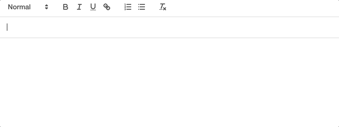

# quill-auto-detect-url

This module is based on [quill-magic-url](https://www.npmjs.com/package/quill-magic-url)

It was created to transform the url of the url as the user types.

This library supports Quill Version 2 starting from version 1



## [Demo](https://quill-auto-detect-url.bucky.im)

## Install

```
yarn add quill-auto-detect-url
// or
npm install quill-auto-detect-url
```

## Usage

```ts
import Quill from "quill";
import QuillAutoDetectUrl, {
  QuillAutoDetectUrlOptions,
} from "quill-auto-detect-url";

Quill.register("modules/autoDetectUrl", QuillAutoDetectUrl);

const quill = new Quill("#editor", {
  theme: "snow",
  modules: {
    autoDetectUrl: {
      urlRegularExpression: /(https?:\/\/|www\.)[\w-.]+\.[\w-.]+[\S]+/i,
    } as QuillAutoDetectUrlOptions, // or true
  },
});
```

## Options

please see [magic-url docs](https://github.com/visualjerk/quill-magic-url#options)
